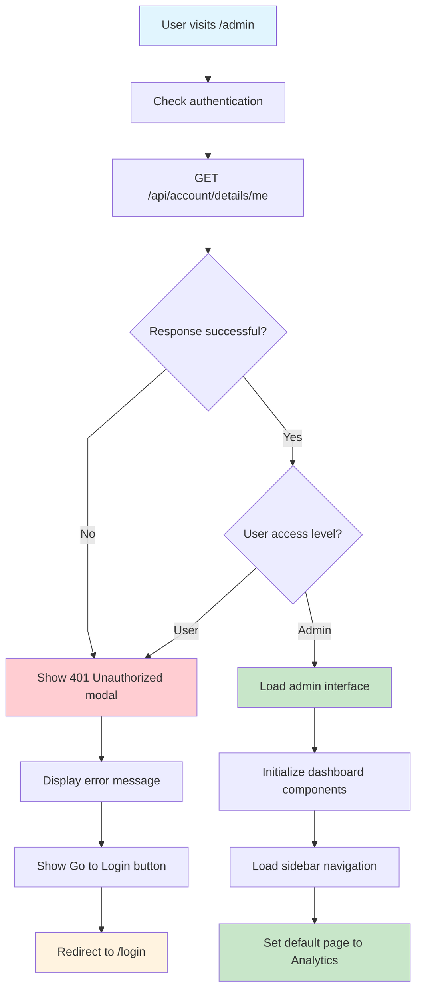
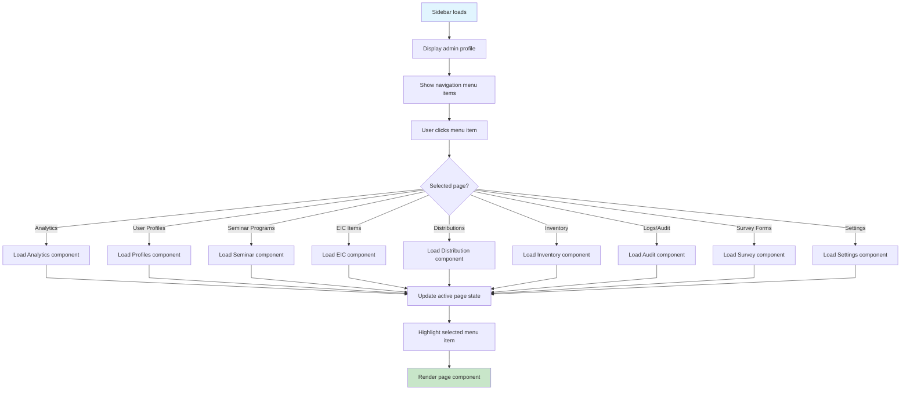
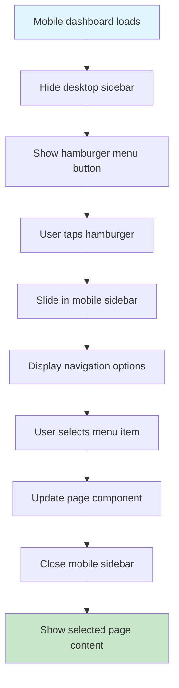
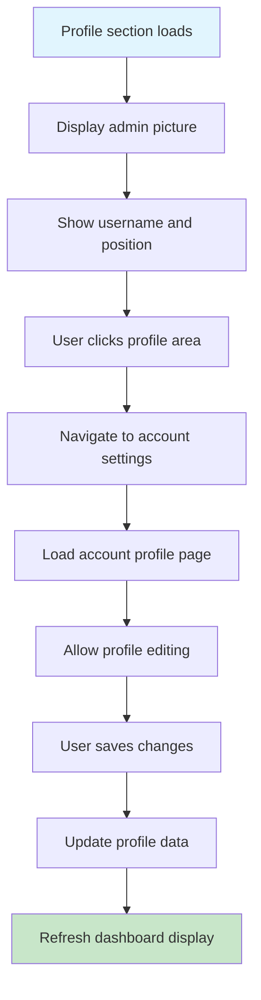
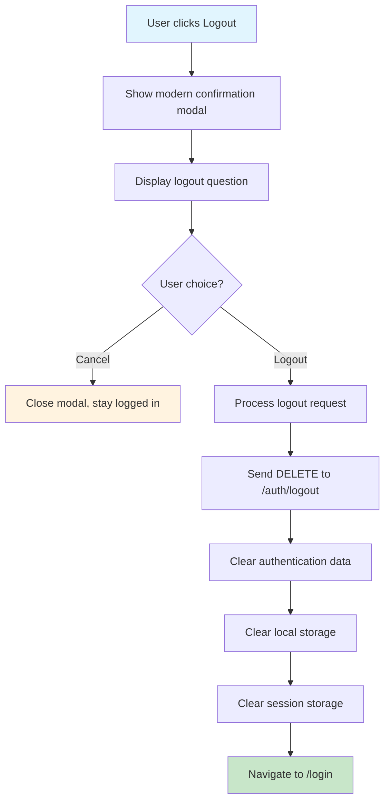
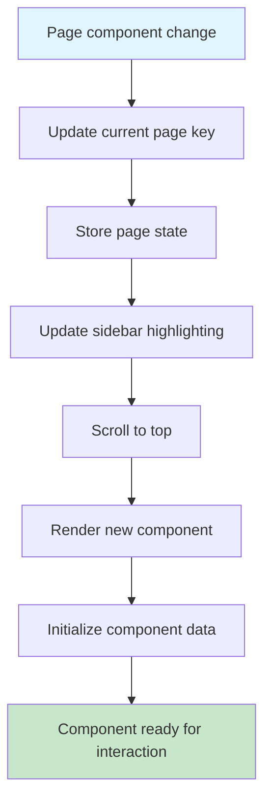
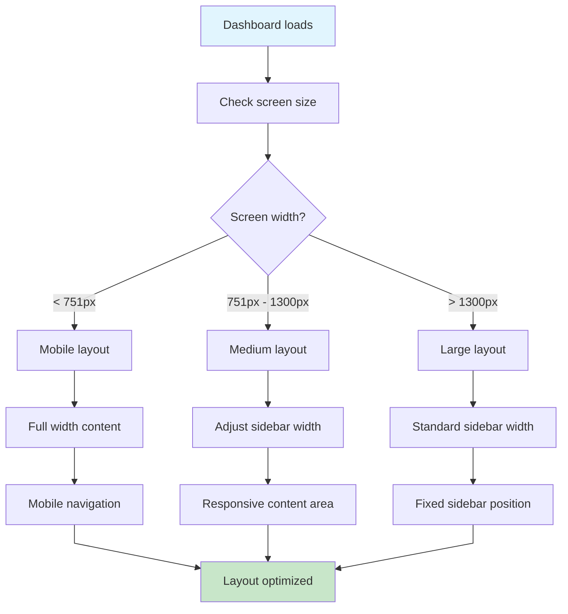
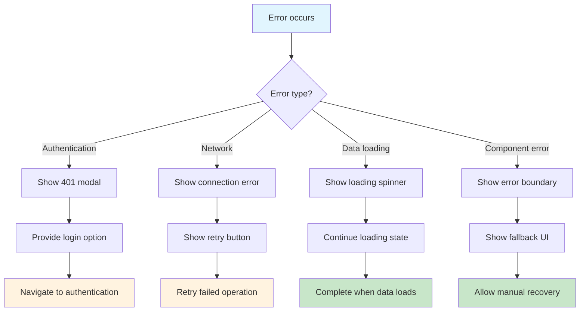

# Admin Dashboard Flow - Farmer Connect

## Dashboard Access Control Flow

## Sidebar Navigation Flow

## Mobile Dashboard Flow

## Admin Profile Management Flow

## Logout Confirmation Flow

## Page State Management Flow

## Responsive Layout Flow

## Error Handling Flow

## Off-Page Connectors

-   **From Client Landing**: A ⟵ [Client Landing Flow](client-landing-flow.md)
-   **From Authentication**: B ⟵ [Authentication Flow](authentication-flow.md)
-   **To Analytics Page**: C ⟶ [Analytics Flow](analytics-flow.md)
-   **To User Management**: D ⟶ [User Management Flow](user-management-flow.md)
-   **To Seminar Management**: E ⟶ [Seminar Management Flow](seminar-management-flow.md)
-   **To EIC Management**: F ⟶ [EIC Management Flow](eic-management-flow.md)
-   **To Inventory Management**: G ⟶ [Inventory Management Flow](inventory-management-flow.md)
