# Analytics Dashboard Flow - Farmer Connect Admin

## Analytics Page Access Flow

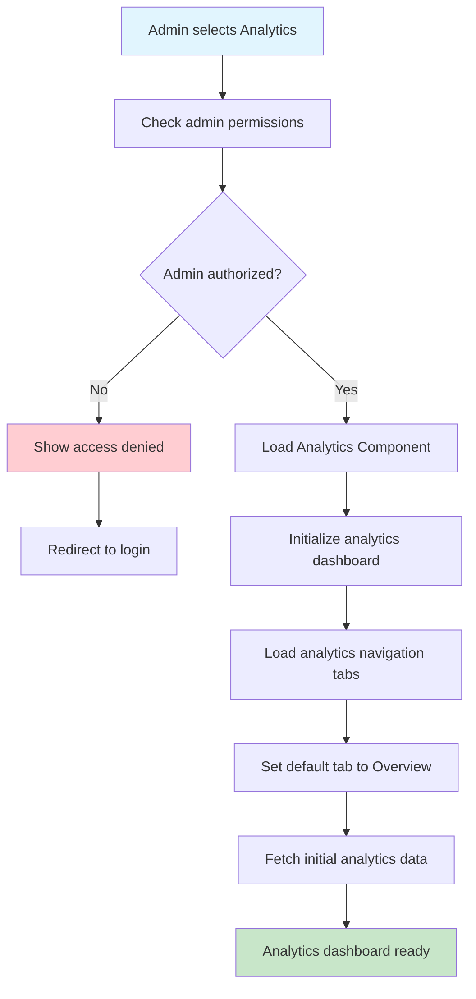

## Analytics Navigation Flow

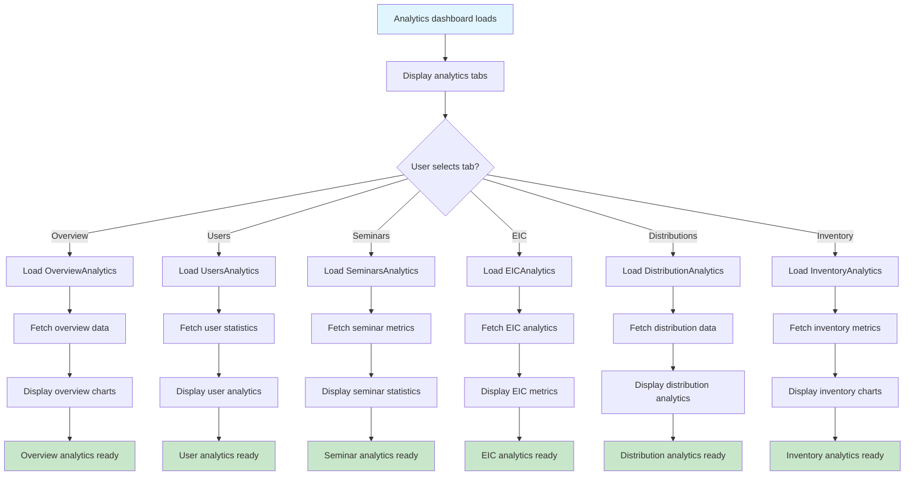

## Overview Analytics Flow

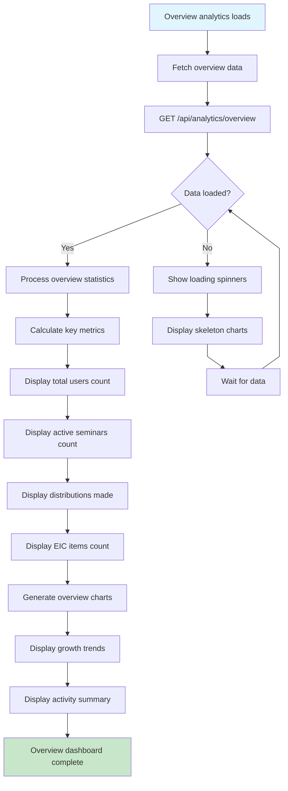

## User Analytics Flow

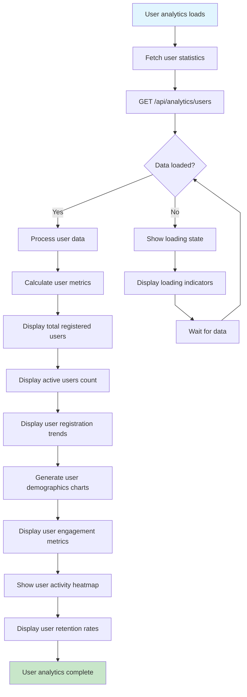

## Seminar Analytics Flow

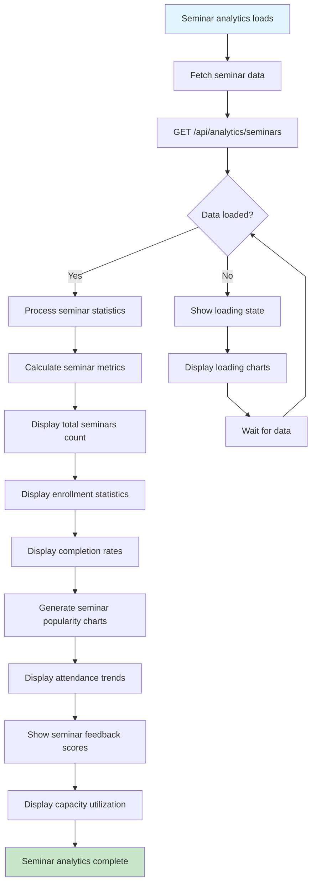

## EIC Analytics Flow

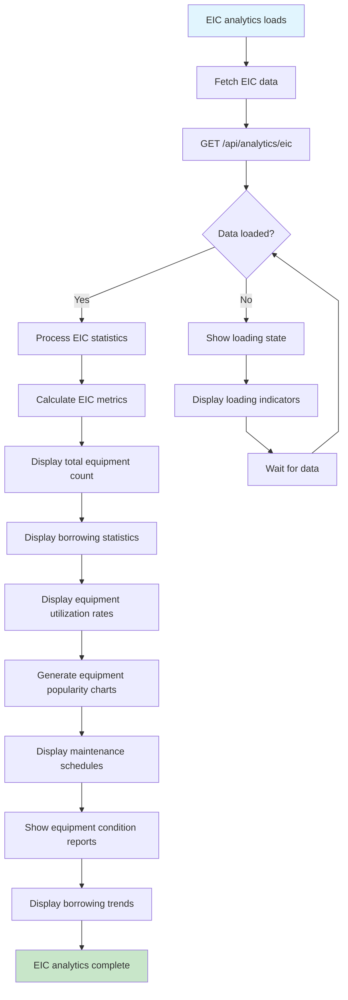

## Distribution Analytics Flow

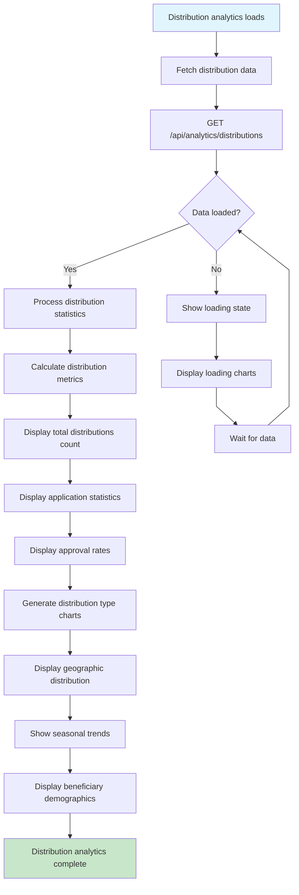

## Inventory Analytics Flow

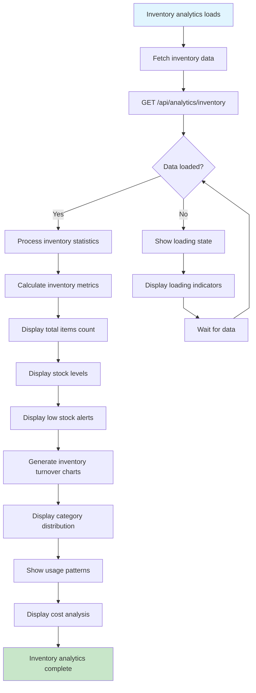

## Chart Interaction Flow

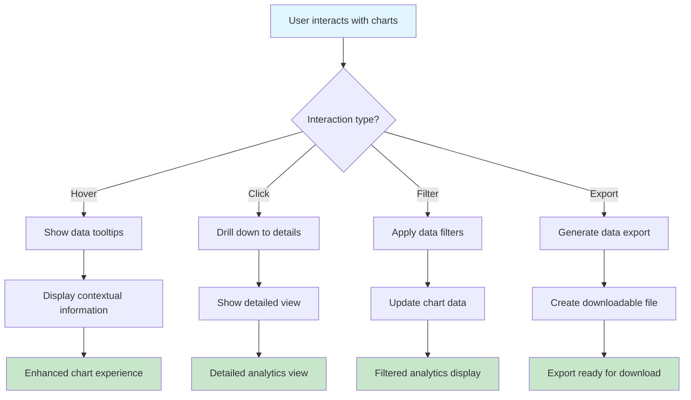

## Real-time Data Updates Flow

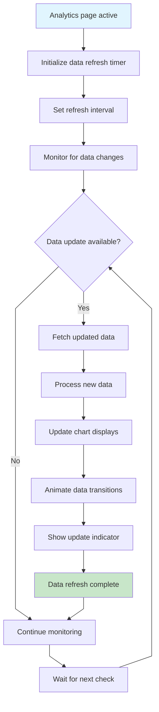

## Analytics Export Flow

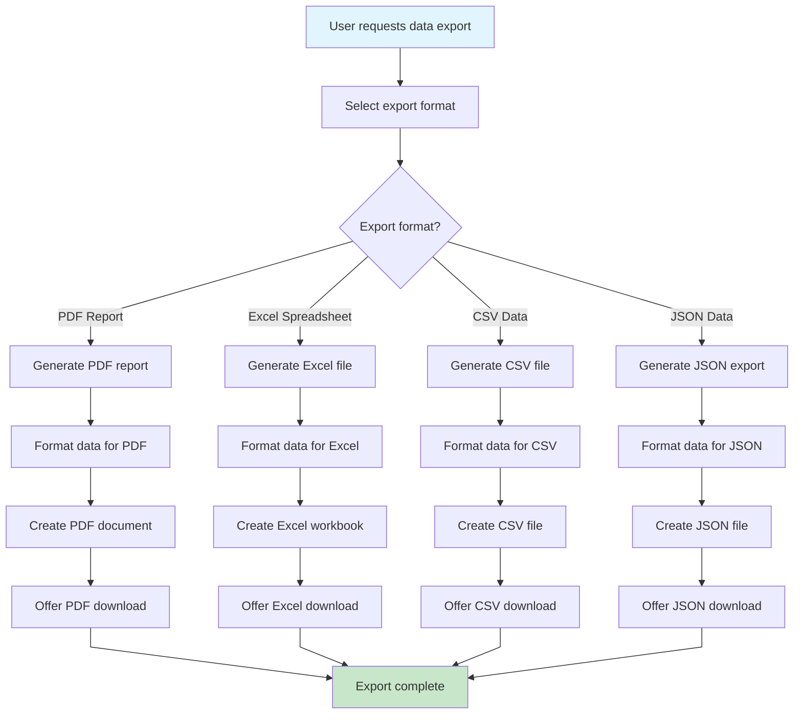

## Error Handling Flow

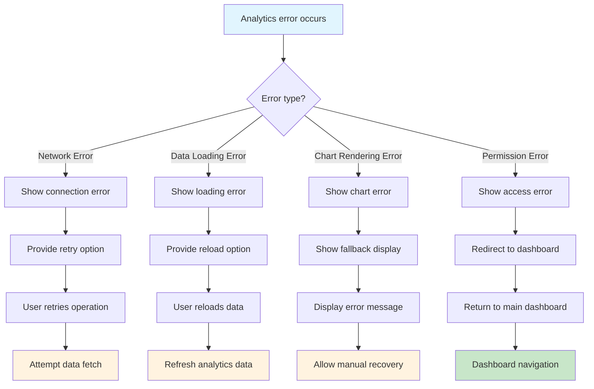

## Off-Page Connectors

-   **From Admin Dashboard**: A ⟵ [Admin Dashboard Flow](admin-dashboard-flow.md)
-   **To User Management**: B ⟶ [User Management Flow](user-management-flow.md)
-   **To Seminar Management**: C ⟶ [Seminar Management Flow](seminar-management-flow.md)
-   **To EIC Management**: D ⟶ [EIC Management Flow](eic-management-flow.md)
-   **To Distribution Management**: E ⟶ [Distribution Management Flow](distribution-management-flow.md)
-   **To Inventory Management**: F ⟶ [Inventory Management Flow](inventory-management-flow.md)
