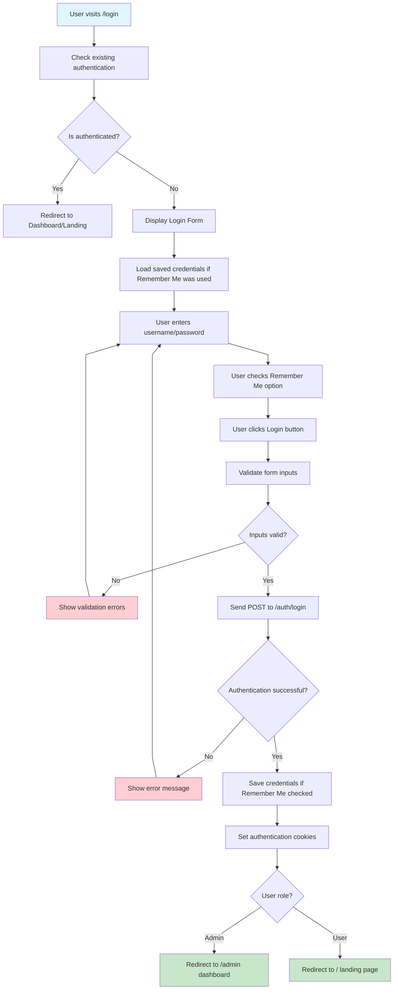
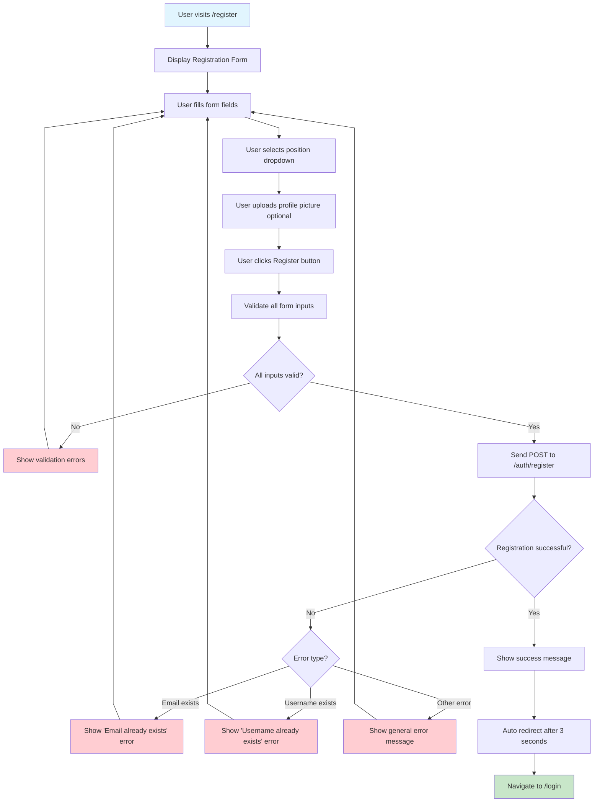
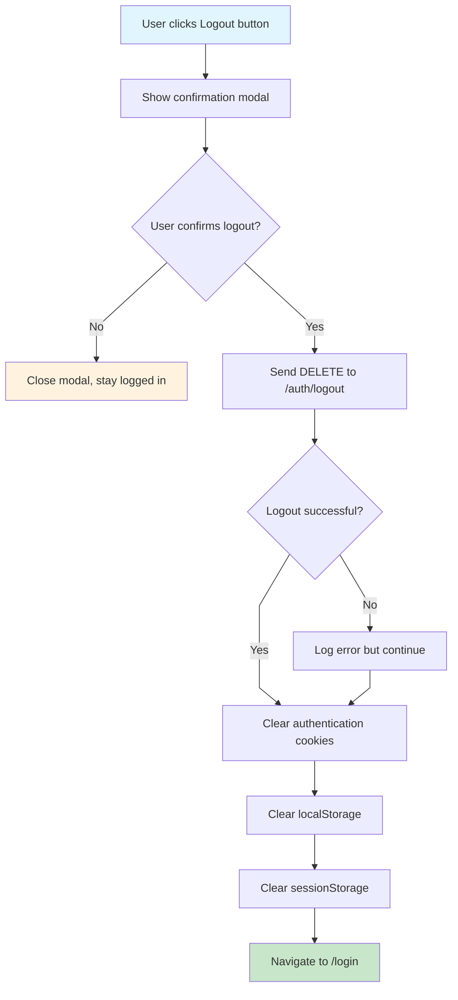
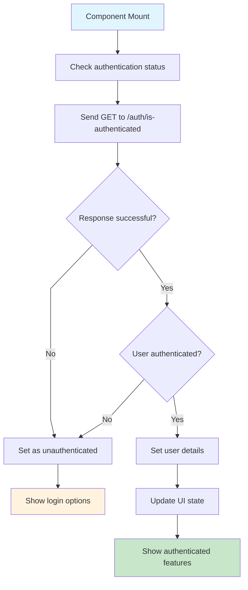

# Authentication Flow - Farmer Connect

## Login Process Flow

## Registration Process Flow

## Logout Process Flow

## Authentication State Management

## Off-Page Connectors

-   **To Admin Dashboard**: A ⟶ [Admin Flow](admin-dashboard-flow.md)
-   **To Client Landing**: B ⟶ [Client Flow](client-landing-flow.md)
-   **To Settings**: C ⟶ [Settings Flow](settings-flow.md)
