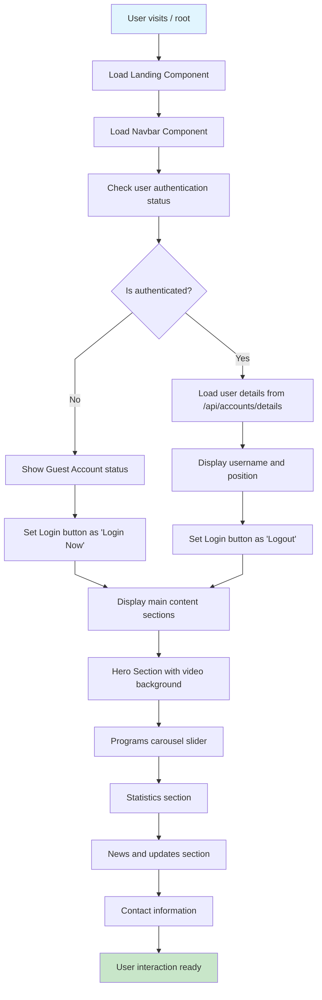
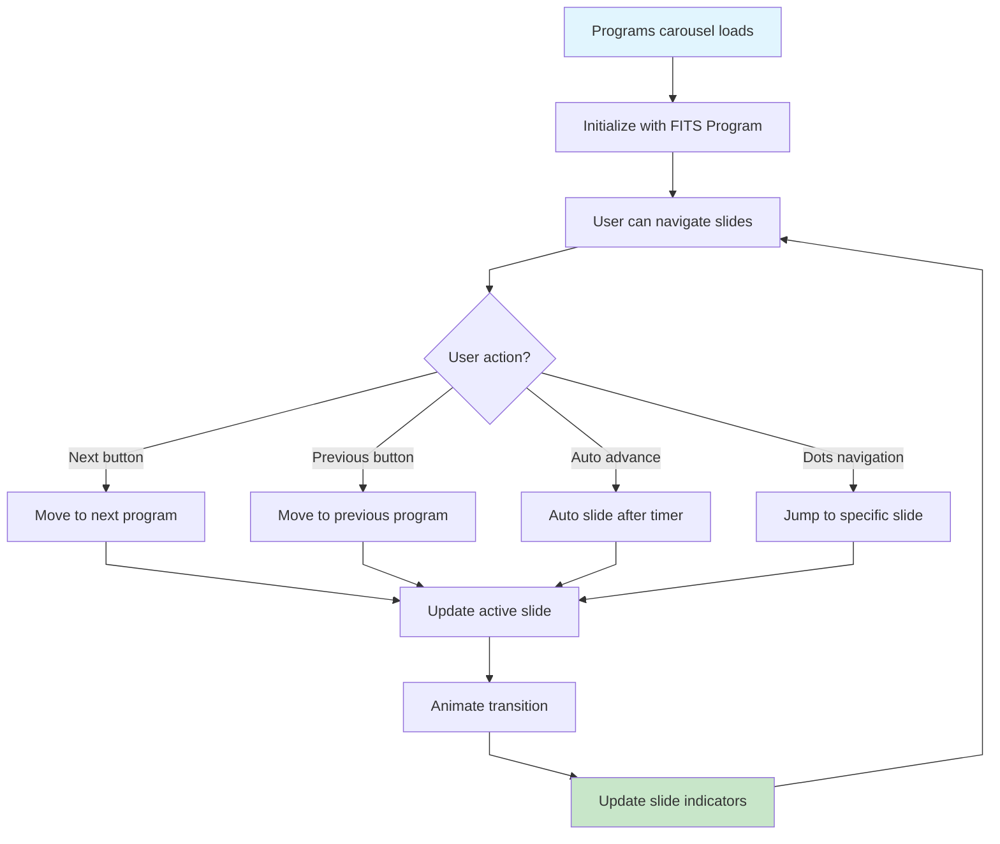
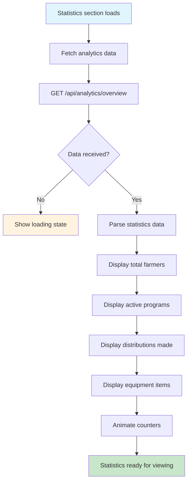
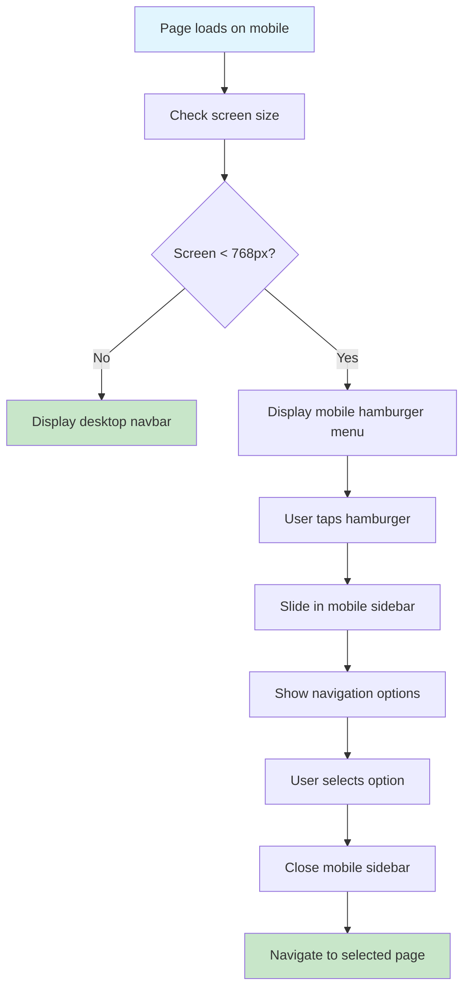
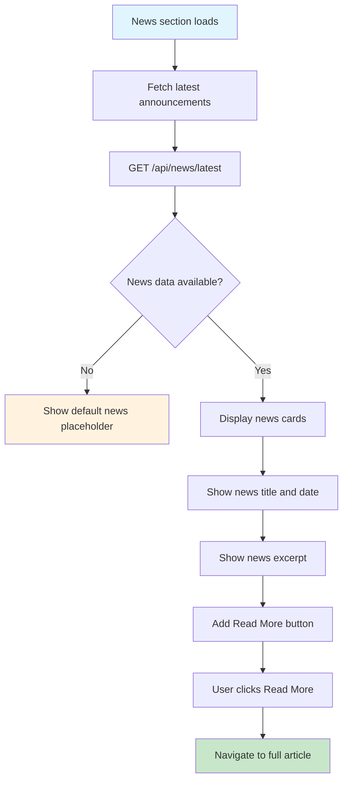

# Client Landing Page Flow - Farmer Connect

## Landing Page Navigation Flow



## Navbar Interaction Flow

```mermaid
%%{init: {'flowchart': {'curve': 'linear'}}}%%
flowchart TD
    A[User interacts with Navbar] --> B{Navigation choice?}
    B -->|Home| C[Scroll to top]
    B -->|Profile| D{User authenticated?}
    D -->|No| E[Redirect to /login]
    D -->|Yes| F[Navigate to /profiles]
    B -->|Enrollment| G[Navigate to /enrollment]
    B -->|EIC| H[Navigate to /EIC]
    B -->|Settings| I[Navigate to /settings]
    B -->|Distributions| J[Navigate to /distribution]
    B -->|About| K[Navigate to /about]
    B -->|Contact| L[Navigate to /contact]
    B -->|Login/Logout| M{Current state?}
    M -->|Guest| N ⟶ [Authentication Flow](authentication-flow.md)
    M -->|Logged in| O ⟶ [Authentication Flow](authentication-flow.md)

    style A fill:#e1f5fe
    style C fill:#c8e6c9
    style E fill:#fff3e0
    style F fill:#c8e6c9
    style G fill:#c8e6c9
    style H fill:#c8e6c9
    style I fill:#c8e6c9
    style J fill:#c8e6c9
    style K fill:#c8e6c9
    style L fill:#c8e6c9
```

## Programs Carousel Flow



## Statistics Dashboard Flow



## Mobile Responsive Flow



## News and Updates Flow



## Off-Page Connectors

-   **From Authentication**: A ⟵ [Authentication Flow](authentication-flow.md)
-   **To EIC Page**: B ⟶ [EIC Flow](eic-flow.md)
-   **To Seminar Page**: C ⟶ [Seminar Flow](seminar-flow.md)
-   **To Distribution Page**: D ⟶ [Distribution Flow](distribution-flow.md)
-   **To Profile Settings**: E ⟶ [Settings Flow](settings-flow.md)
-   **To Admin Dashboard**: F ⟶ [Admin Dashboard Flow](admin-dashboard-flow.md)
