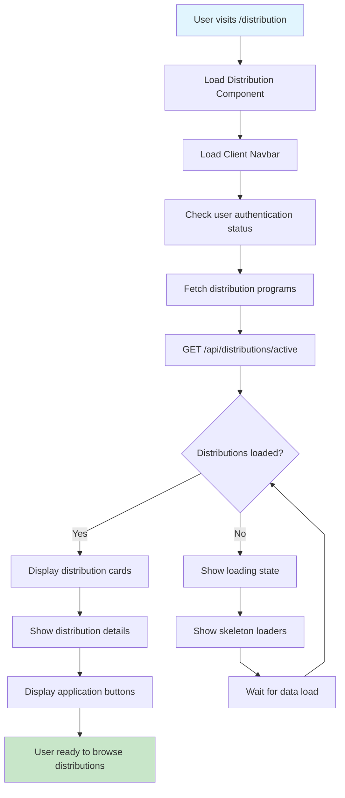
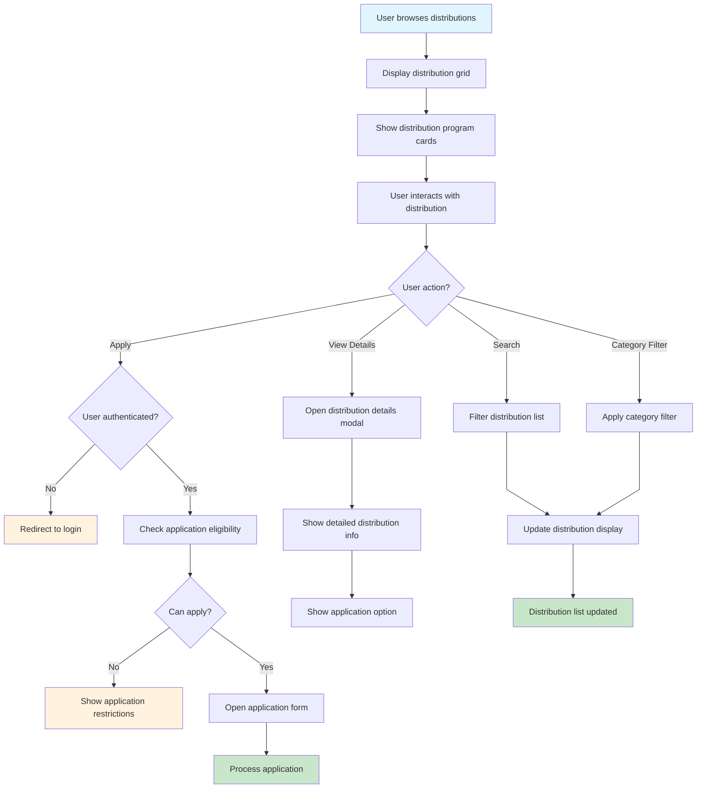
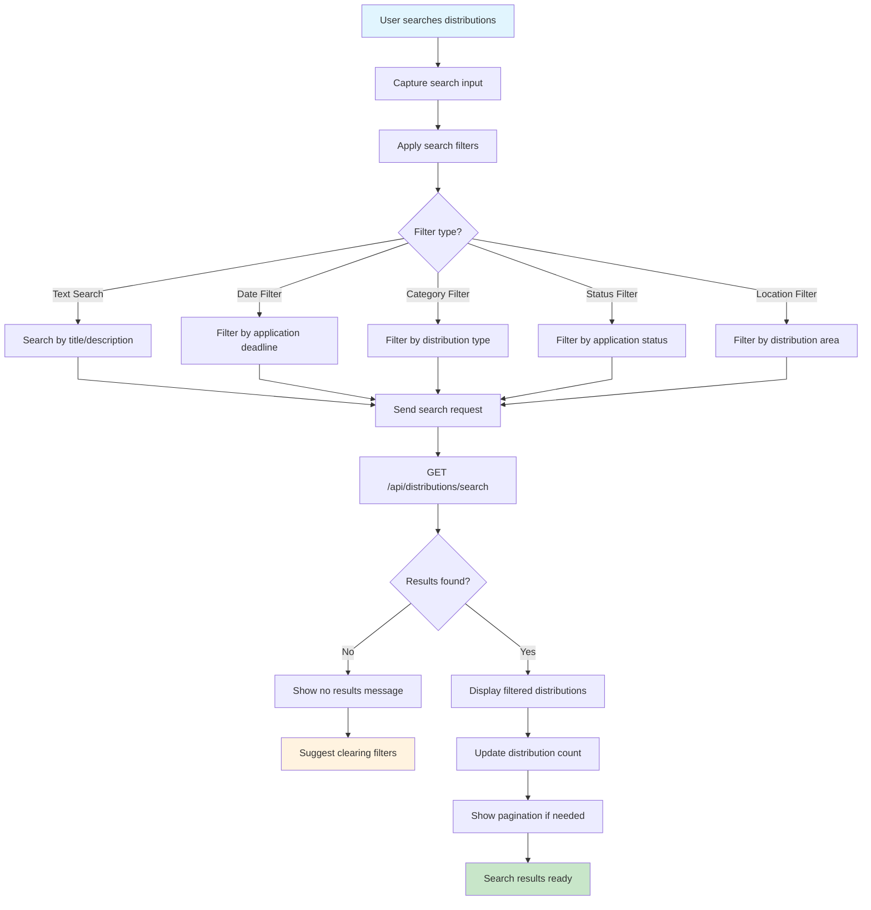
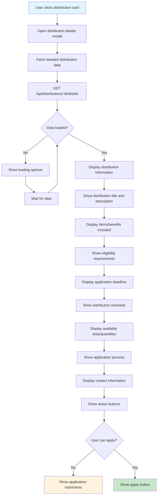
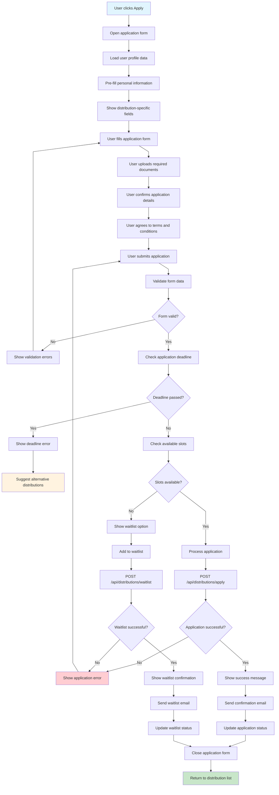
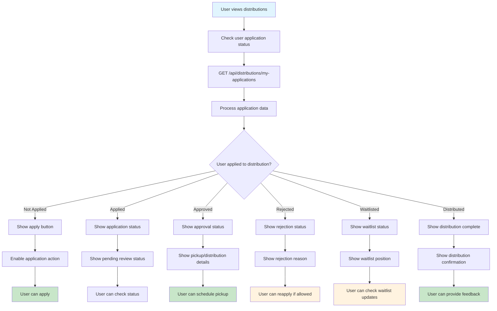
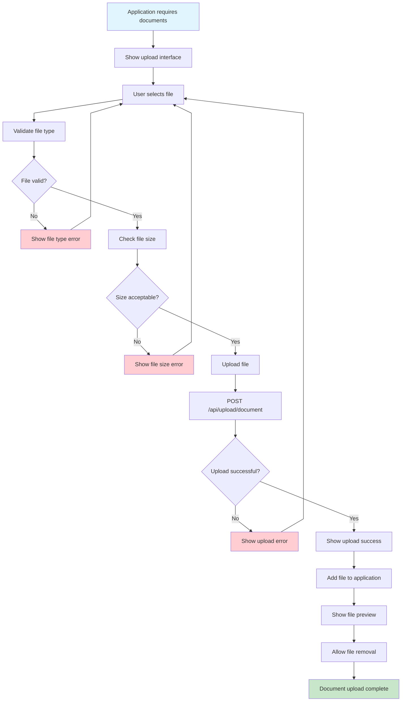
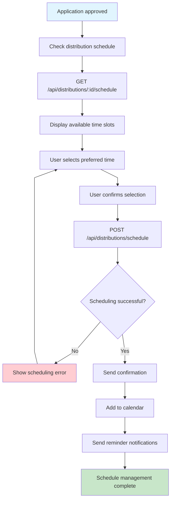
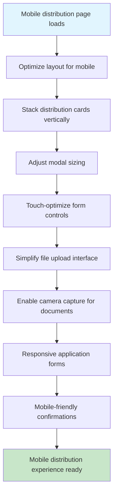
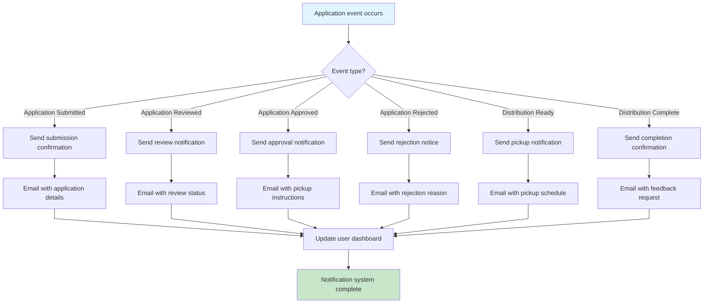

# Distribution Page Flow - Farmer Connect

## Distribution Landing Page Flow

## Distribution Browsing Flow

## Distribution Search and Filter Flow

## Distribution Details Modal Flow

## Application Process Flow

## Application Status Management Flow

## Document Upload Flow

## Distribution Schedule Management Flow

## Mobile Distribution Flow

## Notification System Flow

## Off-Page Connectors

-   **From Client Landing**: A ⟵ [Client Landing Flow](client-landing-flow.md)
-   **From Admin Distribution Management**: B ⟵ [Distribution Management Flow](distribution-management-flow.md)
-   **To Authentication**: C ⟶ [Authentication Flow](authentication-flow.md)
-   **To User Profile**: D ⟶ [Settings Flow](settings-flow.md)
