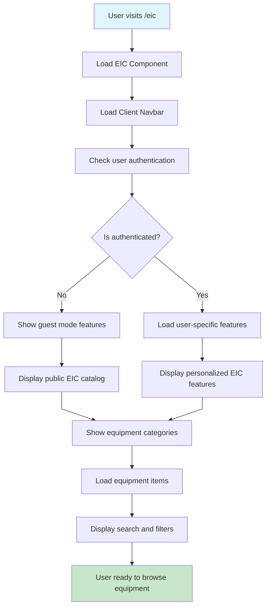
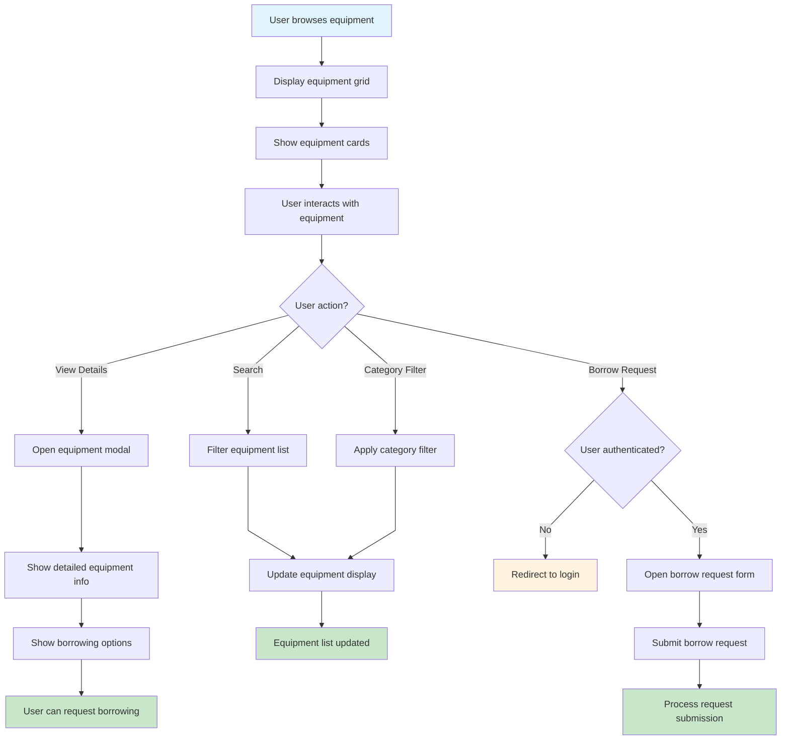
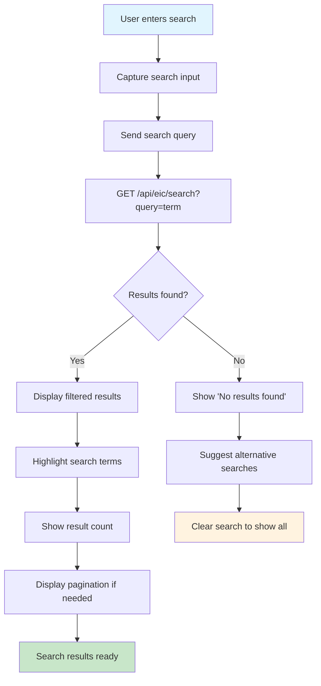
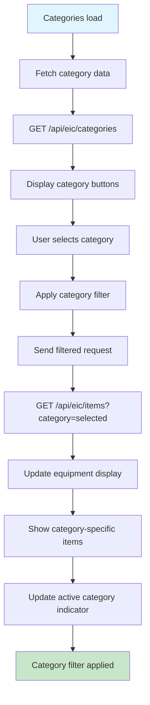
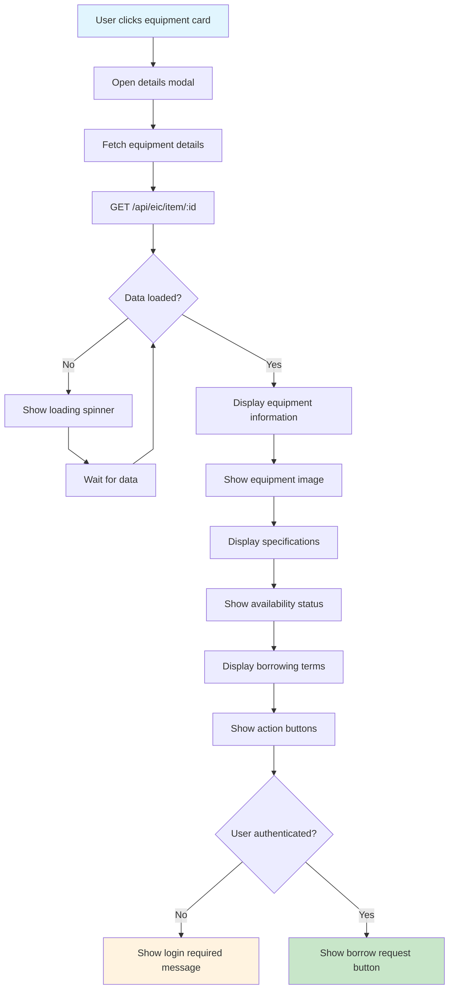
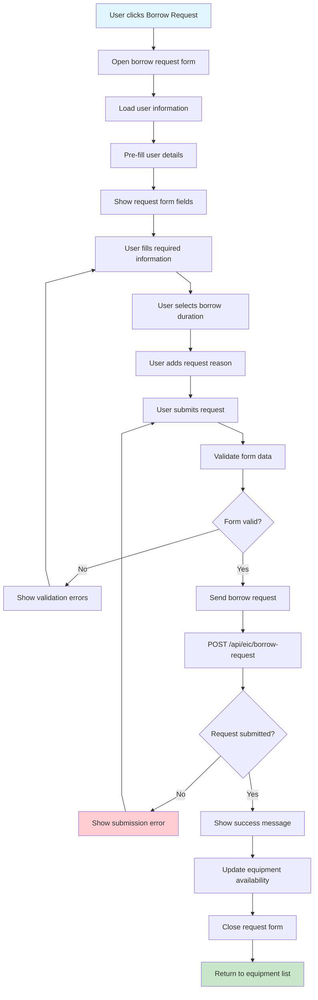
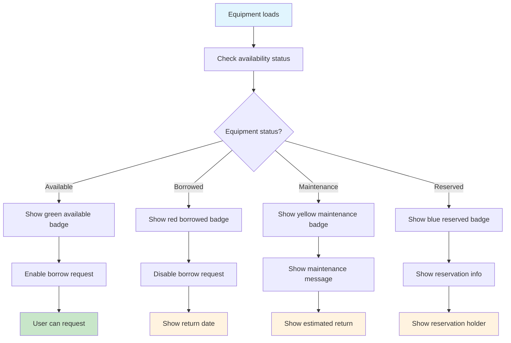
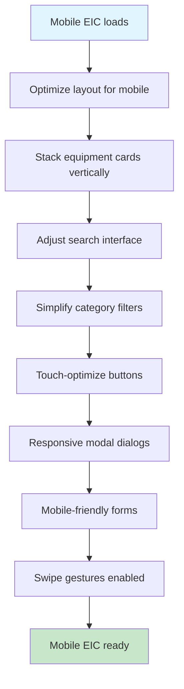
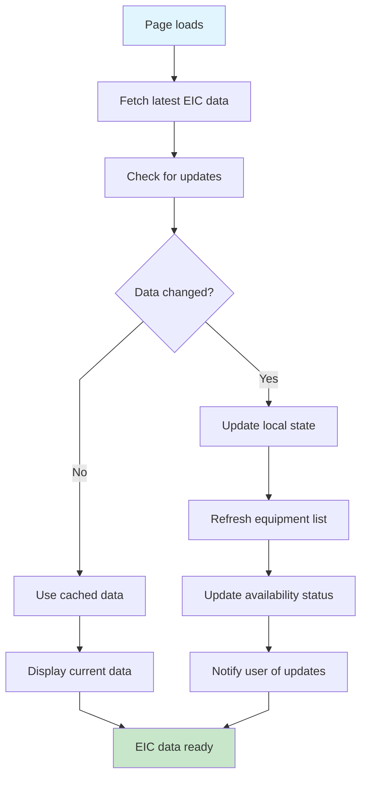

# EIC (Equipment Information Center) Flow - Farmer Connect

## EIC Landing Page Flow

## Equipment Browsing Flow

## Equipment Search Flow

## Equipment Categories Flow

## Equipment Details Modal Flow

## Borrow Request Flow

## Equipment Availability Status Flow

## Mobile EIC Flow

## EIC Data Synchronization Flow

## Off-Page Connectors

-   **From Client Landing**: A ⟵ [Client Landing Flow](client-landing-flow.md)
-   **From Admin EIC Management**: B ⟵ [EIC Management Flow](eic-management-flow.md)
-   **To Authentication**: C ⟶ [Authentication Flow](authentication-flow.md)
-   **To User Profile**: D ⟶ [Settings Flow](settings-flow.md)
