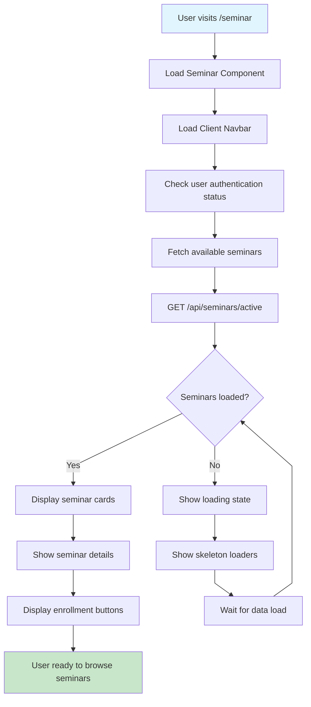
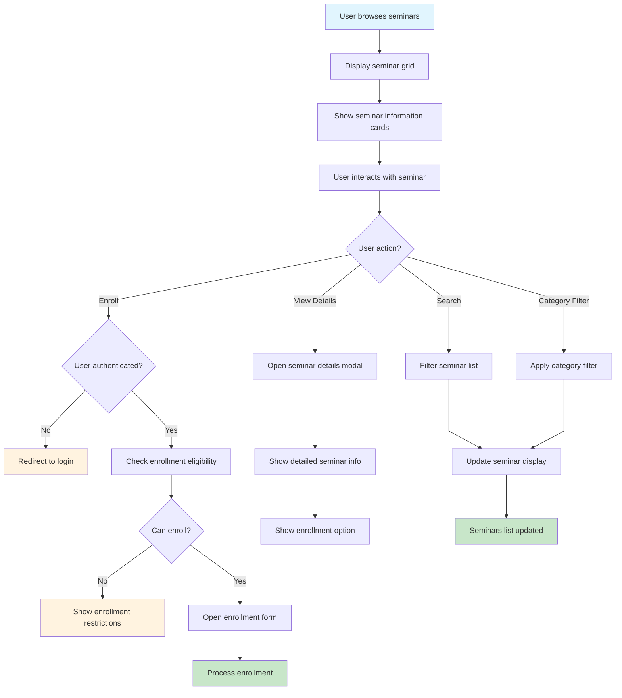
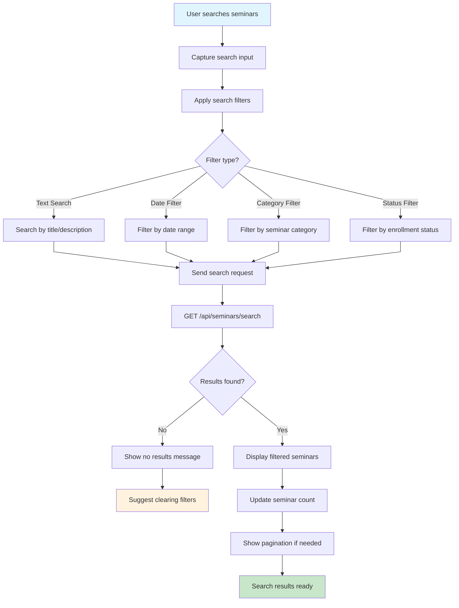
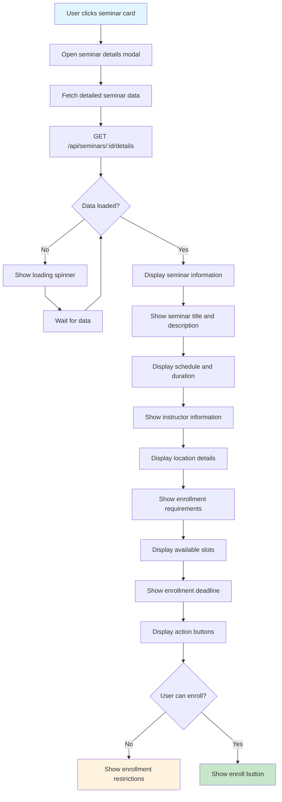
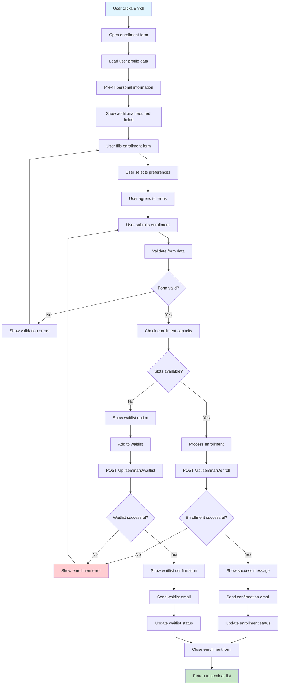
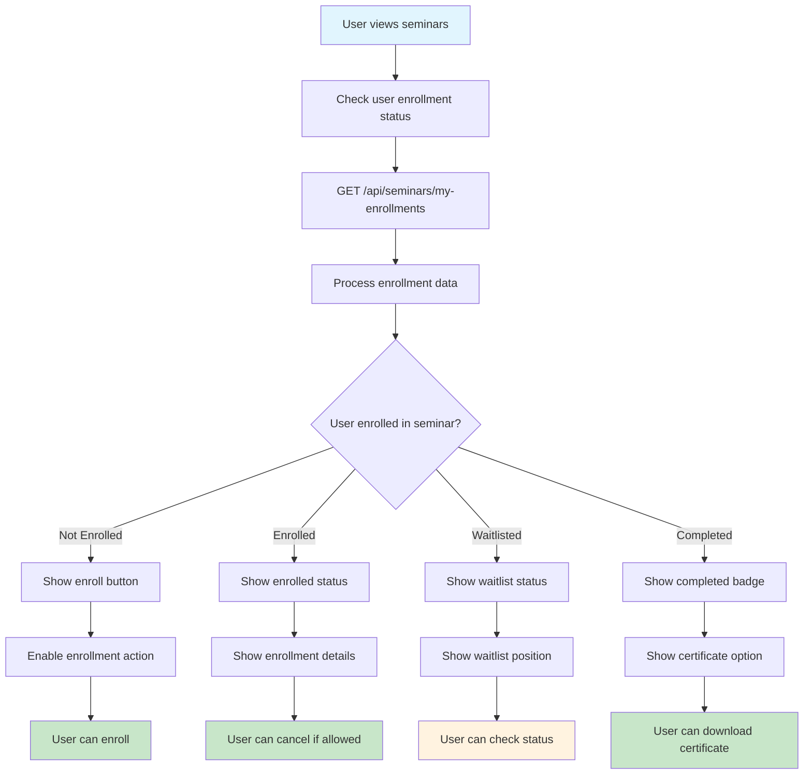
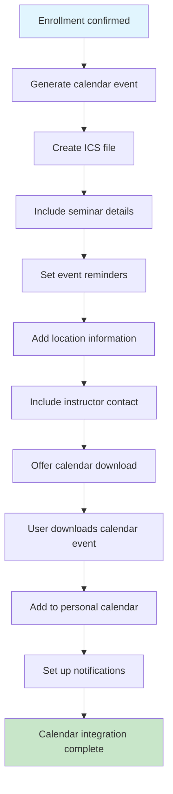
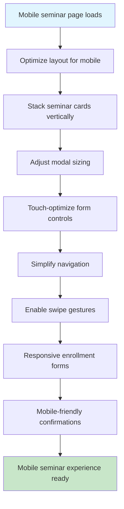
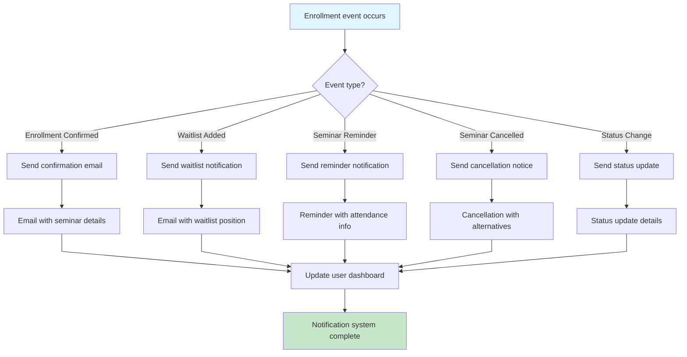

# Seminar/Enrollment Flow - Farmer Connect

## Seminar Landing Page Flow

## Seminar Browsing Flow

## Seminar Search and Filter Flow

## Seminar Details Modal Flow

## Enrollment Process Flow

## Enrollment Status Management Flow

## Seminar Calendar Integration Flow

## Mobile Seminar Flow

## Notification System Flow

## Off-Page Connectors

-   **From Client Landing**: A ⟵ [Client Landing Flow](client-landing-flow.md)
-   **From Admin Seminar Management**: B ⟵ [Seminar Management Flow](seminar-management-flow.md)
-   **To Authentication**: C ⟶ [Authentication Flow](authentication-flow.md)
-   **To User Profile**: D ⟶ [Settings Flow](settings-flow.md)
