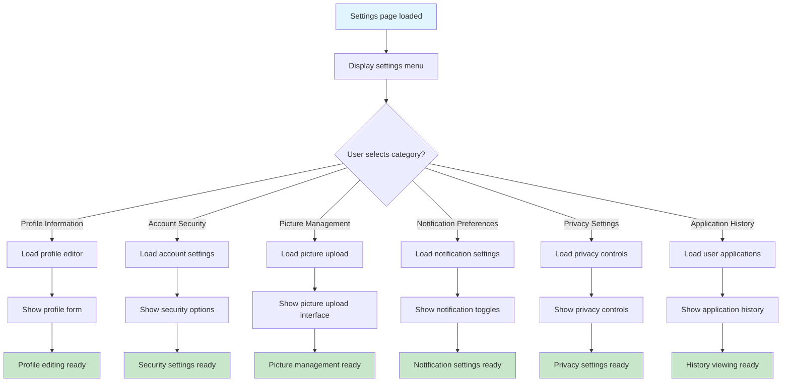
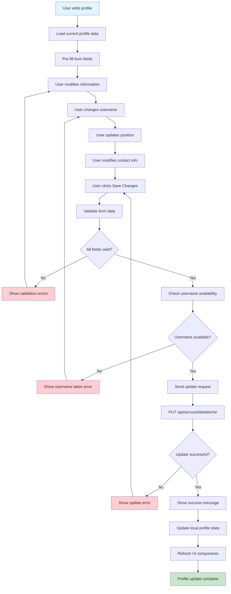
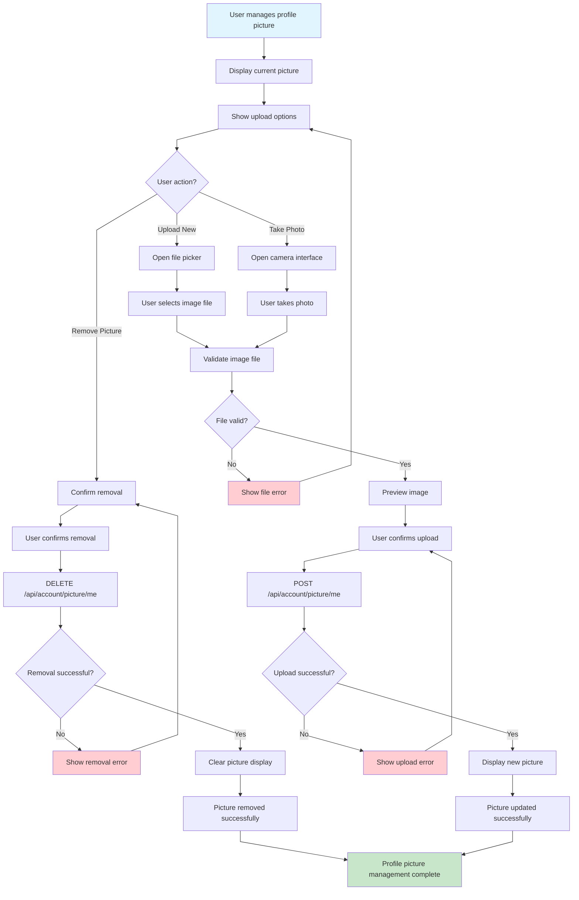
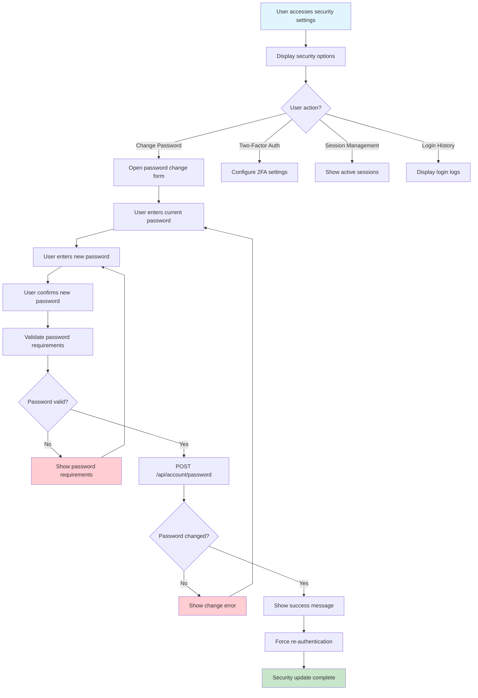
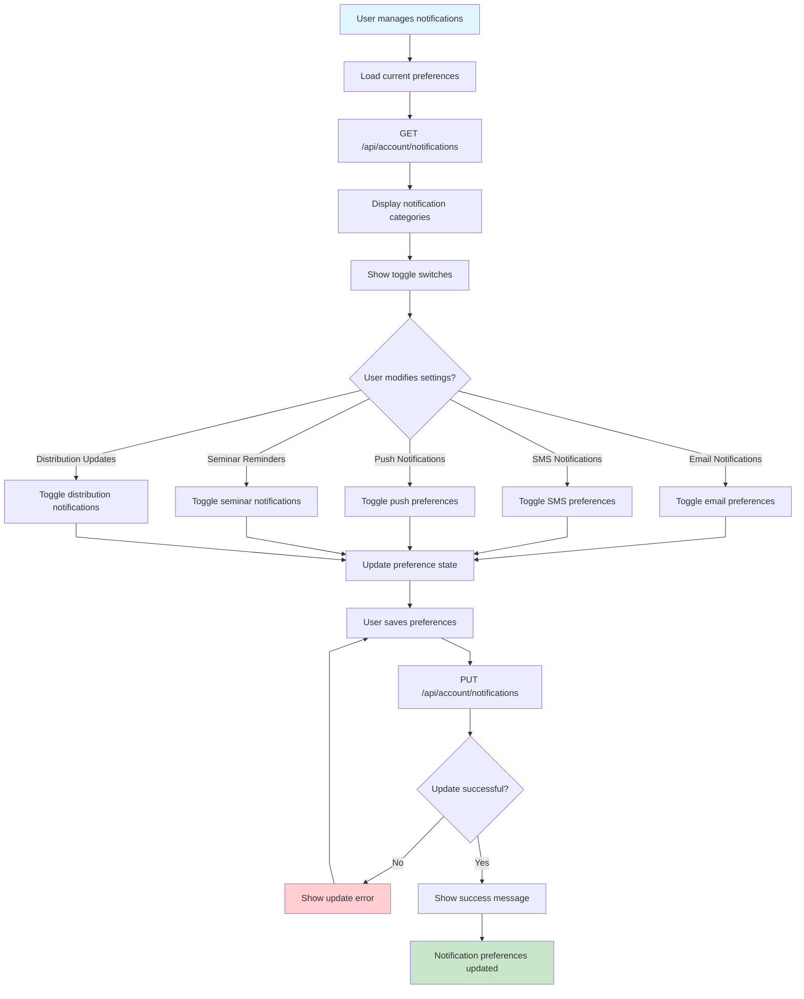
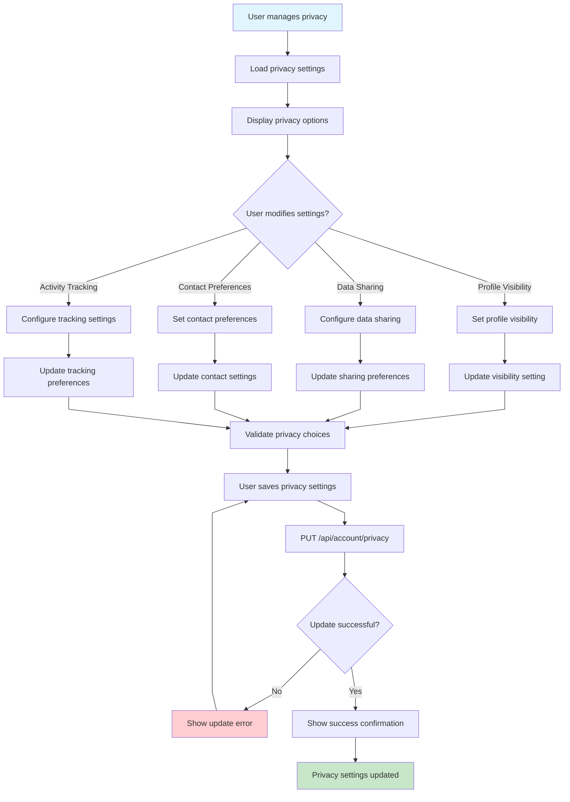
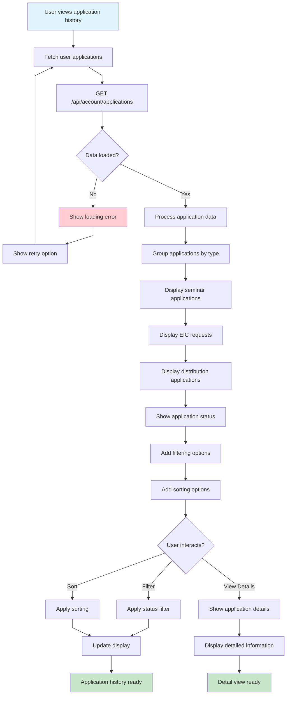
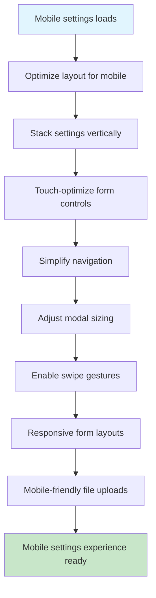
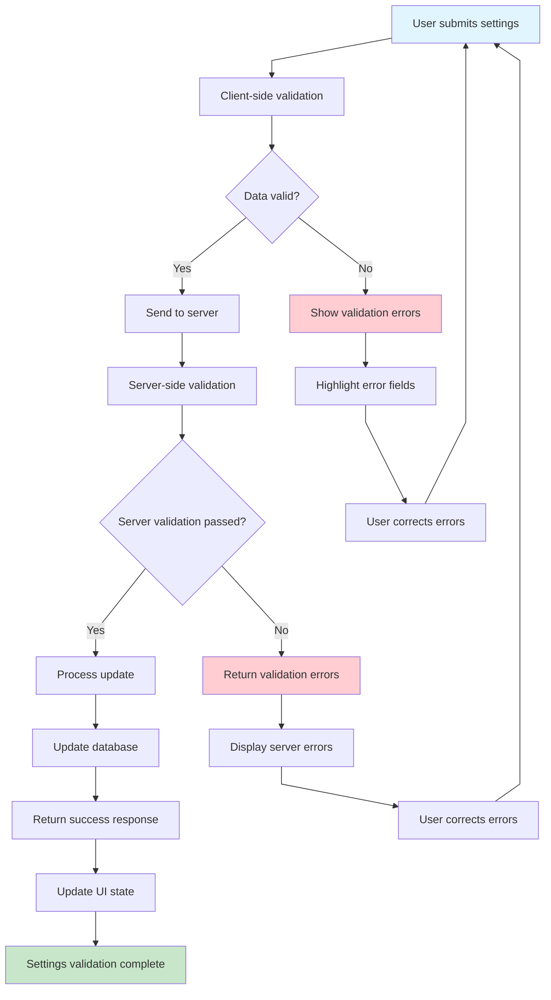

# Settings and Profile Management Flow - Farmer Connect

## Settings Page Access Flow

```mermaid
%%{init: {'flowchart': {'curve': 'linear'}}}%%
flowchart TD
    A[User navigates to settings] --> B{Authentication required?}
    B -->|No| C[Redirect to login]
    B -->|Yes| D[Load Settings Page]
    C --> E ⟶ [Authentication Flow](authentication-flow.md)
    D --> F[Check user permissions]
    F --> G[Load user profile data]
    G --> H[GET /api/account/details/me]
    H --> I{Data loaded successfully?}
    I -->|No| J[Show loading error]
    I -->|Yes| K[Display settings navigation]
    J --> L[Show retry option]
    K --> M[Show settings categories]
    L --> H
    M --> N[User ready to manage settings]

    style A fill:#e1f5fe
    style N fill:#c8e6c9
    style C fill:#fff3e0
    style J fill:#ffcdd2
```

## Profile Settings Navigation Flow



## Profile Information Edit Flow



## Profile Picture Management Flow



## Account Security Settings Flow



## Notification Preferences Flow



## Privacy Settings Flow



## Application History Flow



## Mobile Settings Flow



## Settings Validation Flow



## Off-Page Connectors

-   **From Client Landing**: A ⟵ [Client Landing Flow](client-landing-flow.md)
-   **From Admin Dashboard**: B ⟵ [Admin Dashboard Flow](admin-dashboard-flow.md)
-   **To Authentication**: C ⟶ [Authentication Flow](authentication-flow.md)
-   **From Seminar Page**: D ⟵ [Seminar Flow](seminar-flow.md)
-   **From EIC Page**: E ⟵ [EIC Flow](eic-flow.md)
-   **From Distribution Page**: F ⟵ [Distribution Flow](distribution-flow.md)
