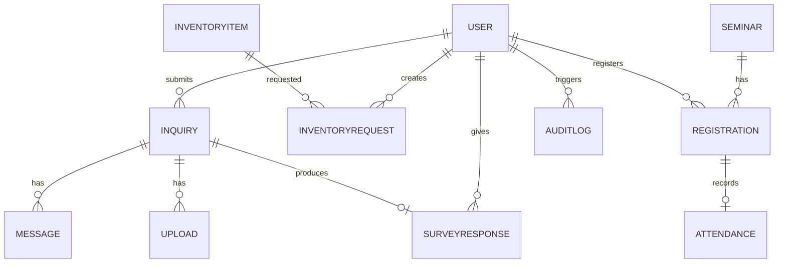

# Data Model Summary

This page summarizes the main entities and relationships. For authoritative schemas, see:

- `Documentation/Inquiry_System_Schema.md`
- Prisma ERD/diagrams under `Documentation/MERMAID/ERD/`

> Note: Names/fields here are intentionally high-level to avoid drift. Rely on Prisma schema for exact details.

## Core Entities

### Account/User
- Purpose: Authentication identity and profile.
- Key ideas: role (user/admin/supervisor), contact info, status.
- Touchpoints: Auth, Seminars, Inventory Requests, Inquiries, Chat, Surveys.

### Inquiry
- Purpose: A support case submitted by a user; may include attachments and location/category.
- Lifecycle: submitted → assigned → in_progress → resolved → surveyed.
- Relationships: createdBy (User), messages (Chat), attachments (Uploads), surveyResponse.

### Message/Chat
- Purpose: Real-time and persisted conversation tied to an inquiry.
- Key ideas: sender (user/admin), timestamps, attachments, delivery receipts (optional).

### SurveyResponse
- Purpose: Post-resolution feedback linked to an inquiry.
- Key ideas: rating scores, text feedback, createdAt.

### InventoryItem / InventoryRequest
- Purpose: Track available items and user requests.
- Key ideas: quantity, status (pending/approved/denied/fulfilled), distribution schedule.

### Seminar / Registration / Attendance
- Purpose: Seminars/events with registration and attendance tracking.
- Key ideas: capacity, schedule, participant list, check-in/out.

### FAQCategory / FAQItem
- Purpose: Knowledge base for recurring questions.
- Key ideas: category hierarchy, content, visibility.

### AuditLog
- Purpose: Immutable trail of significant actions.
- Key ideas: actor, action, target (entity/id), metadata, timestamp.

## Relationships (Simplified Diagram)

## Where to Look in Code

- Server models/migrations: `server/prisma/**`
- Domain controllers: `server/Controller/**`
- Sample seeds: `server/prisma/seed*.js`
