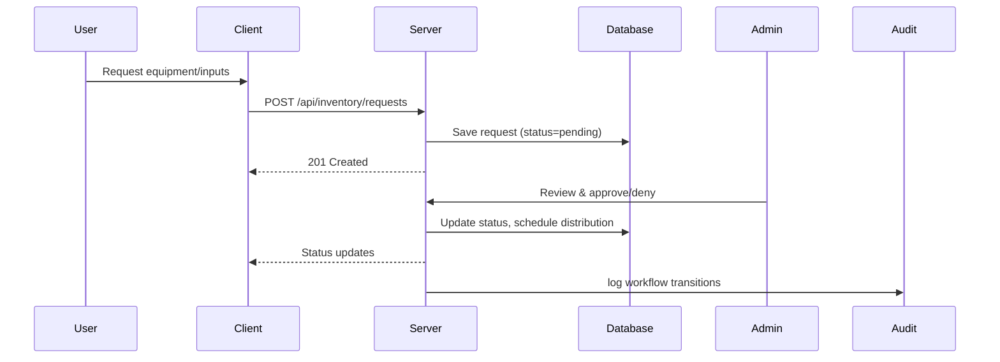

# System Flow

This page maps the end-to-end journeys for the most important use cases. Each flow links back to relevant code locations and existing docs.

## Legend

- REST API: Express routes under `server/Router/**` (controllers in `server/Controller/**`, services in `server/Services/**`).
- Sockets: Socket.IO handlers under `server/Sockets/**` (client context `client/src/contexts/SocketContext.jsx`).
- DB: Prisma models and migrations in `server/prisma/**`.

## 1) Inquiry Lifecycle (Citizen → Admin)

High-level stages: Draft → Submitted → Triaged/Assigned → In Progress (chat) → Resolved → Survey → Analytics & Audit.

```mermaid
sequenceDiagram
  participant U as User (Client)
  participant C as Client App
  participant S as Server API
  participant SK as Socket.IO
  participant DB as Database

  U->>C: Fill Inquiry Form (+files)
  C->>S: POST /api/inquiry (JWT, multipart)
  S->>DB: Create Inquiry, store files via Multer
  S-->>C: 201 Created (inquiryId, status=submitted)
  S->>SK: emit("inquiry:new", {inquiryId})
  SK-->>Admin Clients: realtime notification

  Admin->>C: Opens Admin Dashboard
  C->>S: GET /api/inquiry/:id (details)
  Admin->>S: PATCH /api/inquiry/:id (assign, priority)
  S->>DB: Update assignment
  S->>SK: emit("inquiry:assigned", {inquiryId, assignee})

  U<->>Admin: Real-time chat and status updates
  C<->>SK: socket.emit("message:send"), receive("message:new")
  S->>Audit: write(action="message_sent", user, inquiryId)

  Admin->>S: PATCH /api/inquiry/:id (status=resolved)
  S->>DB: Update status
  S->>SK: emit("inquiry:resolved", {inquiryId})

  S->>U: Email/Notification with survey link
  U->>S: POST /api/surveys/response (inquiryId, ratings, comments)
  S->>DB: Save survey response; Audit log

  Admin/Supervisor->>S: GET /api/analytics/…
  S->>DB: Aggregate metrics
  S-->>Admin: charts/tables
```

Pointers:
- Controllers: `server/Controller/Inquiry/**`, `server/Controller/Survey_Forms/**`
- Services: `server/Services/inquiry/**`, `server/Services/auditLogger.js`
- Sockets: `server/Sockets/handlers/**`, middleware under `server/Sockets/middleware/**`
- Client UI: `client/src/Client/**` and `client/src/Components/**/Survey/**`
- Docs: `Documentation/Inquiry_System_Schema.md`, `Documentation/Stage_Progression_UI_Guide.md`, Socket guides.

## 2) Seminar Registration and Attendance

```mermaid
sequenceDiagram
  participant U as User (Client)
  participant C as Client App
  participant S as Server API
  participant DB as Database

  U->>C: Browse Seminars
  C->>S: GET /api/seminars
  S-->>C: List (title, date, slots)

  U->>C: Register
  C->>S: POST /api/seminars/:id/register
  S->>DB: Create registration; validate capacity
  S-->>C: 200 OK (registrationId)

  Admin->>S: Attendance updates (check-in/out)
  S->>DB: Persist attendance
  S->>Audit: log attendance changes

  Supervisor/Admin->>S: GET /api/analytics/seminars
  S-->>Admin: KPIs by date, category, attendance rate
```

Pointers:
- Controllers: `server/Controller/Seminar/**`
- Client: `client/src/Admin/**` and seminar components
- Docs: `Documentation/MERMAID/Flowchart/seminar-*.mmd`

## 3) Inventory/Equipment Request



Pointers:
- Controllers: `server/Controller/Inventory/**`, `server/Controller/Distribution/**`
- Client: `client/src/Admin/**`, `client/src/Client/**`
- Docs: `Documentation/MERMAID/Flowchart/inventory-*`

## 4) Authentication and Session

```mermaid
sequenceDiagram
  participant U as User
  participant C as Client
  participant S as Server

  U->>C: Login (email/password)
  C->>S: POST /api/auth/login
  S-->>C: JWT (access), profile
  C->>S: Attach JWT in Authorization: Bearer ...
  Note over C,S: Socket connects with auth; see Socket Logout guide
```

Pointers:
- Controllers/Middleware: `server/Controller/Authentication/**`, `server/Middlewares/Auth/**`, `server/Middlewares/JWT/**`
- Client: `client/src/Authentication/**`, `client/src/contexts/SocketContext.jsx`
- Docs: `Documentation/Socket_Integration_Guide.md`, `Documentation/Socket_Logout_Integration_Guide.md`

## Cross-cutting: Audit Logging, Files, Email, Analytics

- Audit: `server/Services/auditLogger.js`, scripts under `server/scripts/**`; logs key user and system actions.
- Files: `server/Utils/multer_upload.js`, `server/Utils/multer_inquiry.js`; stored under `server/public/uploads/`.
- Email: `server/Services/emailService.js`; used for notifications and confirmations.
- Analytics: `server/Controller/Analytics/**` with endpoints summarized in `Documentation/Analytics_API_Endpoints.md`.
